<picture>
  <source media="(prefers-color-scheme: dark)" srcset="./assets/hero-dark.svg" />
  
</picture>

  

<picture>
  <source media="(prefers-color-scheme: dark)" srcset="./assets/feature-dark.svg" />
  
</picture>

  

&nbsp;&nbsp;&nbsp;

&nbsp;&nbsp;&nbsp;

